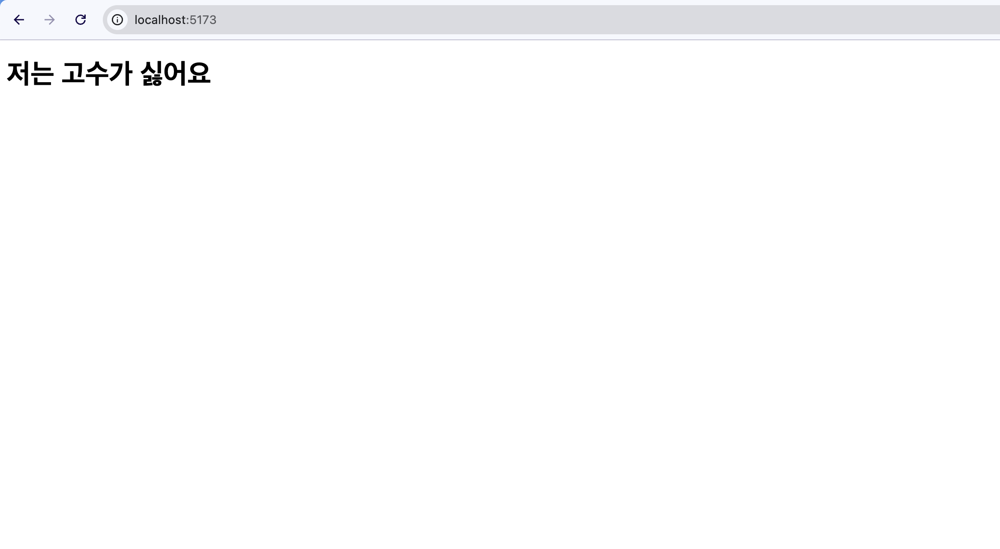

# Day 1

코드는 한 줄도 작성을 못했는데 시작부터 걸리는 점이 있습니다.

> "프레임워크(라이브러리)의 기준이 되어줄 철학이 있어야 할 것 같습니다."

[React](https://react.dev/)는 스스로 공식 문서를 통해 프레임워크가 아닌 라이브러리라고 표현합니다.  
곰곰히 고민해보면 왠지 프레임워크보다는 라이브러리라는 표현이 타당합니다. 그래도 정확한 정의를 알고 있으면 좋겠죠.

### [1] Framework vs Library (feat. IoC)

StackOverflow를 찾다보니 무려 17년 전에 동일한 [질문](https://stackoverflow.com/questions/148747/what-is-the-difference-between-a-framework-and-a-library)을 남긴 사람이 있습니다.

그리고 624개(작성 시점 기준)의 upvote를 받은 답변이 있습니다.

```
A library performs specific, well-defined operations.

A framework is a skeleton where the application defines the "meat" of the operation by filling out the skeleton. The skeleton still has code to link up the parts but the most important work is done by the application.

Examples of libraries: Network protocols, compression, image manipulation, string utilities, regular expression evaluation, math. Operations are self-contained.

Examples of frameworks: Web application system, Plug-in manager, GUI system. The framework defines the concept but the application defines the fundamental functionality that end-users care about.
```

한글로 해석해보면 다음과 같습니다.

"라이브러리는 **특정 작업들을 수행**하는 도구이고 그 자체로 완결성을 가집니다. 필요할 때 사용자가 **호출**해서 사용합니다"

"프레임워크는 **어플리케이션의 뼈대 역할**을 합니다. 사용자는 이 뼈대 안을 채워넣어 실제 기능을 수행합니다"

**누가 누구를 호출하는지** 를 생각해보면 간단합니다. 라이브러리는 작성자가 라이브러리 코드를 호출하는 반면, 프레임워크는 프레임워크가 작성자의 코드를 호출하는 구조입니다. 이 케이스를 소프트웨어 설계 관점에서 표현하면 **IoC(Inversion of Control)** 이라고 합니다.


여기까지의 내용을 정리해보면, 우선은 "라이브러리"를 만드는 것이 맞아보입니다.

### [2] 라이브러리를 만들어봅시다

저는 React와 친숙하다보니 React와 비슷한 UI 라이브러리를 만들어보고자 합니다.

결국 "비슷한" 라이브러리가 아닌 "어떤" 라이브러리를 정의하려면 간단하더라도 나름의 철학이 필요하다고 생각합니다. 그러므로 그간의 개발 경험을 되돌아보면서 어디선가 들어봤던 철학 비스무리한 것들을 떠올려봅니다.

UI는 상태(State)의 함수라던지, 순수함수 기반으로 Element를 만든다던지, 선언형 UI라던지, 단방향/양방향 데이터 흐름과 같은 것들이 있습니다.

오늘은 처음 시작이니까 간단한 철학 하나만 정해보려고 합니다.

"UI는 데이터의 스냅샷이다"

스냅샷(snapshot)이란 특정 시점의 데이터를 캡쳐한 것을 의미합니다.
UI 역시 어떤 시점의 데이터가 화면에 투영된 사진에 불과합니다.

- t=0 일 때 데이터가 { count: 0 } 이면 화면에는 0이 보여야 합니다.
- t=1 일 때 데이터가 { count: 1 } 이면 화면에는 1이 보여야 하구요.

데이터가 바뀌면 새로운 사진을 찍으면 됩니다.
이 원리를 기반으로 아주 작은 UI 엔진을 만들어보겠습니다.

저는 사실 고수를 안좋아합니다.
그래서 아래와 같은 UI를 보여줄 수 있는 데이터를 만들어보려고 합니다.

```html
<h1>저는 고수가 싫어요</h1>
```

### [3] UI를 데이터로

이 단순한 UI는 다음과 같은 구조화된 데이터로 변환해볼 수 있습니다.

```js
const snapshot = {
  type: "h1",
  content: "저는 고수가 싫어요",
};
```

(프론트엔드 개발을 해본 사람이라면, 그 중에서도 React를 써보신 분들이라면 `props`도 있고 `id`도 있고 데이터 확장을 고려해야한다고 답답할 수도 있지만 차근차근 진행해보려고 합니다.)

이 정도면 우선 충분히 표현할 수 있으니까요.

이제 이 snapshot를 실제 DOM Element로 만들어볼 차례입니다.  
즉 데이터를 UI로 변환하는 렌더링 함수가 필요합니다.

### [4] 데이터를 다시 UI로: 렌더러 만들기

딱 "한 개의 태그와 한 개의 텍스트"만을 처리(변환)하는 렌더러 함수를 상상해봅시다.
(아직은 typescript도 사치입니다)

```js
// packages/core/src/index.js

function render(snapshot, container) {
  const el = document.createElement(snapshot.type);
  const text = document.createTextNode(snapshot.content);
  el.appendChild(text);

  container.appendChild(el);
}
```

매우 단순하지만 1) snapshot 객체를 받아서, 2) DOM Element를 만들고, 3) 지정한 컨테이너에 붙이는 기능을 수행합니다.

그리고 이 렌더링 함수는 다음과 같이 사용합니다.

```js
// playground/src/main.js

import { render } from "@cilantro/core";

const snapshot = {
  type: "h1",
  content: "저는 고수가 싫어요",
};

const container = document.getElementById("app");
render(snapshot, container);
```

```html
<!-- playground/index.html -->

<html>
  ...
  <body>
    <div id="app"></div>
    <script type="module" src="/src/main.js"></script>
  </body>
</html>
```

그러면 우리가 기대한 UI가 나오게됩니다.


<p style="text-align: center; color:#aaaaaa;">실행 결과</p>

여튼 처음 이야기한 것과 같이 UI가 나오기는 했습니다.
대단한 무언가를 만들 것처럼 시작하긴 했지만 여튼 종이비행기 같은걸 만들긴 했지만 처음은 다 이런거 아니겠습니까.

내일은 우리가 흔히 구현할 때 사용하는 attributes, multiple children, nested elements 등의 조금 더 복잡한 구조를 핸들링할 수 있는 스냅샷의 구조를 설계해보도록 하겠습니다.

오늘 작성한 내용의 전체 코드는 아래에서 보실 수 있습니다.

> Day1: https://github.com/jaehuiui/hate-cilantro/tree/day-1
