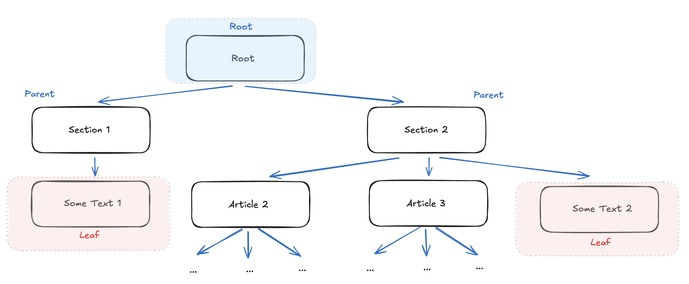

# Day-1-α 

### [1] React는 정말 라이브러리인가요

1일차의 글을 읽고서는 왠지 의문이 생기는 분들이 있으리라 생각합니다.  
(제가 React 생태계에서 개발을 해서 더욱 그럴 수도 있습니다)

> React는 hook과 같은 사용 규칙도 있고, 렌더링 사이클도 제어하고, JSX(JavaScript XML)라는 DSL(Domain Specific Language)도 강제하는데 프레임워크가 아닌가요?

제가 나름대로 고민한 내용을 남겨보겠습니다.  
혹시나 설명이 부족하거나 다른 의견이 있다면 언제든 남겨주세요.

---

React 공식 문서를 보면 강조하는 문장이 있습니다.

> 'React: The library for web and native user interfaces'

정말 순도 100% 라이브러리라고 자신할 수 있을까요?  

제 관점에서는 React에서 제어권의 역전(IoC)이 일어난 지점이 두 가지 존재합니다.  
첫 번째는 Hook의 실행 순서, 두 번째는 컴포넌트와 렌더링 사이클입니다. 

Hook의 실행 순서는 React 내부적으로 제어하고 있습니다.  
유저가 작성한 코드를 React가 원하는 시점에 실행하는 것이죠.

물론 이는 제어권을 가져오기 위한 규칙이라기보다는    
React가 '최소한의 정보로 상태를 추론하고 연결'하기 위한 제약에 가깝습니다.

유사하게 React가 컴포넌트를 호출하고 렌더링 사이클을 관리하는 흐름 역시,    
선언적 UI를 유지하기 위해 사용자에게 일부 제약을 요구하는 설계 선택에 가깝습니다.

두 가지 예시 모두 Ioc(Inversion of Control)가 드러나기에 React는 'UI 프레임워크'라고 볼 수도 있습니다.

하지만 React 팀이 스스로를 '라이브러리'라 지칭하는 이유는 어플리케이션 전체의 구조를 강제하지 않기 때문입니다.  
React는 UI를 '선언적(Declarative)'으로 표현하는 문제만 집중하고, 라우팅, http request, 빌드, 배포와 같은 어플리케이션 생명주기에는 관여하지 않습니다.  
이 과정들은 모두 사용자의 선택입니다.

반면 대표적인 프레임워크인 Vercel의 [Next.js](https://vercel.com/frameworks/nextjs)나 구글의 [Angular.js](https://angularjs.org/)는 대부분의 영역에서 규칙을 강제합니다.

따라서 전체 어플리케이션 관점에서는 라이브러리로 볼 수 있지 않을까 싶습니다.

---

### [2] DOM은 왜 트리 구조를 좋아할까요?

앞선 챕터들에서 트리(Tree) 구조라는 표현이 몇 번 나왔습니다.

DOM은 왜 이렇게 트리 구조를 좋아할까요?

HTML 문서 계층을 파싱하여 데이터 구조로 변환한 결과물은 트리 구조만이 유일한 형태일까요?  
연결 리스트(Linked List), 1차원 배열(1-dimension Array), 심지어 그래프 구조(Graph)와 같은 대부분의 자료구조로 전부 표현할 수 있지 않을까요?

그럼에도 트리구조가 채택된 이유는 트리구조가 가진 특성 때문입니다.

> A tree data structure is a hierarchical structure that is used to represent and organize data in a way that is easy to navigate and search. It is a collection of nodes that are connected by edges and has a hierarchical relationship between the nodes.

- 부분(Subtree)을 독립적인 의미 단위로 다룰 수 있고,
- 부모가 바뀌면 자식의 맥락(Context)도 함께 재해석되며,
- UI를 루트에서 리프까지, 위에서 아래로 해석할 수 있습니다.

HTML의 구조는 기본적으로 **포함 관계**이며 단방향이고 계층적입니다.  
하나의 요소(Element)는 반드시 하나의 부모(parent)를 가지는 구조입니다.  
또한 HTML의 구조는 부분(Subtree)의 구조가 전체에 종속되고 부모에서 자식으로 맥락(Context)이 전달됩니다.

예시로 들었던 그래프(Graph)는 다중 부모를 가질 수 있고 순환 구조이기에 부적합합니다.  
리스트나 배열에서는 부분을 분리한다는 개념이 없고, 부모 자식 관계를 표현하는 것은 가능하지만 `lookup` 비용이 `O(n)`으로 큰 편입니다.

무엇보다 **DOM이라는 자료 구조는 UI를 렌더링하기 위한 객체이자 변경을 계산하기 위한 실행 모델의 역할**을 수행합니다.  
단순히 표현할 수 있다는 것을 넘어, **변경**을 다룬다는 것이 중요합니다.

이 관점에서 HTML을 DOM으로 파싱하는 과정에서 트리 구조를 채택한 것은 가장 합리적인 선택이라고 볼 수 있습니다.