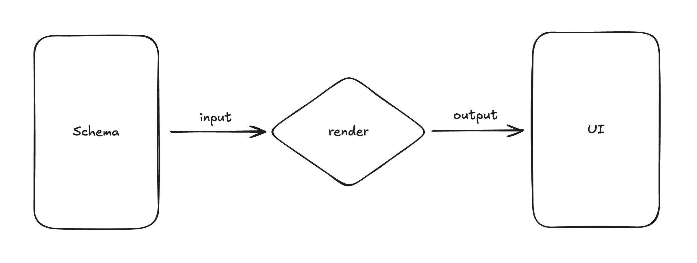
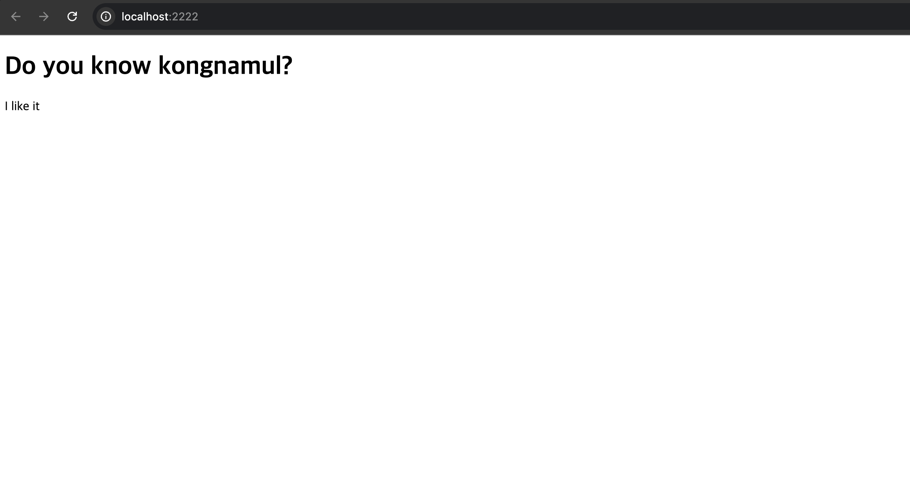
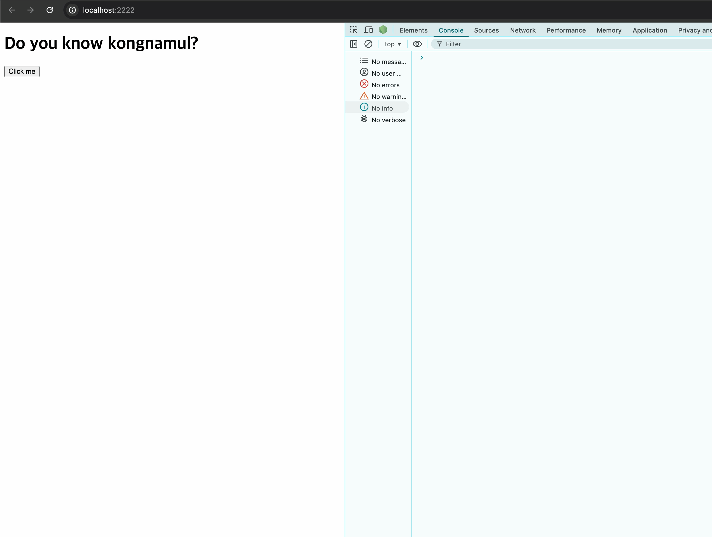

# Day 2: UI를 그려봅시다


React가 사라진 세상에서 살아남기 2일차입니다.

1일차를 마치며 남겨두었던 질문에서 시작해보겠습니다.  

> 상태 변화와 DOM 업데이트를 동기화하는 방법은 무엇일까요?

오늘은 이 질문의 첫 번째 조각을 풀어볼 시간입니다.  
`kongnamul`의 정의를 다시 한 번 살펴보면 실마리가 보일까요.

```
웹 어플리케이션의 UI를 선언적으로 관리하는 라이브러리입니다.
```

선언적으로 UI를 관리한다는 것은,  
상태가 바뀌었을 때 무엇을 어떻게 다시 그릴지를  
개발자가 직접 추적하지 않아도 되게 만든다는 의미였습니다.

그 책임은 라이브러리 내부에서 관리하고, 이렇게 숨겨진 책임을 **추상화**라 일컫습니다.  
우리가 추상화해야 할 동작들을 생각해봅시다.

먼저 **UI가 변할 때 어떻게 DOM에 반영하는 것이 좋을까요?**

단순하게 생각해보면 스케치북을 한 장씩 넘기듯,  
DOM을 아예 전부 지우고 처음부터 다시 그리면 되겠습니다.  
하지만 브라우저의 렌더링 과정은 꽤나 비싼 편입니다.  
복잡한 웹 어플리케이션의 UI를 브라우저가 매번 다시 그리는데는 큰 비용이 요구됩니다.

따라서 **비용을 줄이기 위해서는 변경이 발생한 부분만 DOM에 반영**하면 좋겠습니다.

하지만 우리가 1일차에 이야기했던 내용처럼,  
**DOM은 실시간으로 반영되는 가변 객체**입니다.  
한 번 수정된 DOM은 이전 상태를 스스로 기억할 수 없습니다.  

DOM 내부를 기준으로는 '무엇이 바뀌었는지'를 계산할 수 없고,   
변경을 계산하려면 DOM 외부에 기준이 존재해야 합니다.

결론적으로 오늘 우리가 풀어야 하는 문제를 정해보자면,   
**DOM의 외부에서 UI 변화의 기준을 무엇으로 삼을 것인가** 입니다.

---

### [1] UI가 바뀌었다는 기준은 무엇일까요

UI 변화의 기준을 DOM 바깥에 둔다고 했을 때,  
우리가 선택할 수 있는 방법은 생각보다 다양합니다.

- proxy, observable, signal과 같은 패턴으로 UI의 변화를 즉시 추적할 수도 있고
- UI를 투영한 결과물을 만들어서 이전 UI와 현재 UI의 결과를 비교할 수도 있습니다

두 가지 모두 나름의 장점과 trade-off가 존재합니다.  
또한 한 가지 방법만이 배타적으로 존재해야 하는 것도 아닙니다.   
하나의 라이브러리에 두 가지 방법 모두 포함할 수도 있습니다.  

라이브러리는 방식을 제시할 뿐이고 그 선택은 사용자에게 달려있습니다.  
우선 오늘은 **가장 효율적인 해법을 찾기보다는** 가능한 **명확하게 개념을 검증해볼 수 있는 선택**을 해보려고 합니다.

signal과 proxy 패턴은 변화를 추적하는 방식이고, UI 비교는 말 그대로 결과를 비교(diff)하는 방식입니다.  
전자는 '**무엇이 바뀌었는지**'를 알지만, 후자는 '**무엇이 달라졌는지**'를 압니다.  

우리에겐 아직 상태(state)가 없으므로,   
먼저 **결과를 표현하는 방법부터 정의해보겠습니다.**

이전 UI와 현재 UI를 비교하려면 크게 두 가지가 필요합니다.

1. UI를 **데이터로 표현**할 수 있어야 합니다
2. 두 데이터를 **비교**할 수 있어야 합니다

오늘은 차례대로 **UI를 데이터로 표현하기 위한 인터페이스**를 먼저 만들어 볼 차례입니다.  

---

### [2] 인터페이스를 만들어봅시다

UI를 JS 객체이자 인터페이스로 정의할 때 필요한 요소는 무엇일까요.

결국 DOM과 비슷한 무언가를 만들어야 높은 호환성을 유지할 수 있을겁니다.  
그리고 우리는 이미 1일차에 DOM이 왜 트리 모양인지 충분히 고민해보았습니다.

따라서 인터페이스는 DOM의 투영도(projection) 역할을 수행합니다.   
트리 구조로 표현할 수 있어야 하고, HTML 요소(Element)와 속성(Attribute)을 포함합니다.

간단한 HTML 문서를 살펴봅시다.

```html
<div id="container">
  <h1 id="title">Do you know kongnamul?</h1>
  <p id="description">I like it</p>
</div>
```

무척 간단하지만 앞서 말한 요소들을 모두 만족하고 있습니다.  
`tag`도, `id`라는 속성도, container -> title / description 으로 이어지는 부모-자식 트리 구조도 포함하고 있습니다.

직관적으로 인터페이스로 변환해보면 다음과 같이 나타낼 수 있지 않을까요?

```js
// playground/src/main.js

const schema = {
  type: "div",
  props: {
    id: "container",
  },
  children: [
    {
      type: "h1",
      props: {
        id: "title",
      },
      children: ["Do you know kongnamul?"],
    },
    {
      type: "p",
      props: {
        id: "description",
      },
      children: ["I like it"],
    },
  ],
};
```

깔끔하게 DOM을 투영한 것 같은 형태입니다.  
이 인터페이스는 앞으로 **schema**라는 이름으로 부르도록 하겠습니다.  

참고로 schema라는 표현은 생각보다 범용적인 표현입니다.  
데이터베이스에서는 저장되는 데이터에 대한 설계도의 의미로, 인지과학이나 언어학에서는 지식을 표상하는 구조라는 의미로 사용되곤 합니다.

schema의 필드에 대해 알아보자면,  

- `type`은 HTML Element의 Tag에 해당하는 String입니다.  
- `props`는 HTML Element의 Attribute이면서 필요에 따라 다른 속성을 전달할 수 있어야 하는 Record 타입입니다.
- `children`은 Schema의 1차원 배열입니다. 트리라는 자료 구조에서 자식 노드 간에는 위계가 없고, 자식 노드는 복수 개일 수 있기 때문입니다.

schema를 정의함으로서 UI를 선언적으로 관리하기 위한 첫 걸음을 내딛었습니다.   
우리는 상태가 바뀔 때마다 새로운 schema를 만들고, 이전 schema와 비교할 것입니다.

지금까지의 과정을 정리해보면 다음과 같습니다.

```
UI 변화의 기준을 DOM 외부에 둡니다
                  ↓
결과 비교를 위해서는 UI를 데이터로 표현해야 합니다
                  ↓
UI를 데이터로 표현하는 인터페이스를 schema라 정해봅시다
```

---

### [3] schema는 얼마나 똑똑해야할까요

schema라는 인터페이스의 구성 요소를 정했습니다.

하지만 schema를 UI를 그리기 위한 일종의 **설계도이거나 설명서**라는 시선에서 본다면,  
왠지 아직은 schema가 조금 부족해보입니다.

아예 파격적으로 schema 하나로 UI의 모든 것을 설명해보는 것은 어떨까요?

- 클릭 시 어떤 함수가 실행되는지
- 화면 크기에 따라 어떻게 변하는지
- 언제 생성되고 언제 파괴되는지
- 상태가 바뀌면 무엇을 다시 그릴지

실제로 이와 유사한 접근을 택한 UI 프레임워크도 존재하는 것으로 알고 있습니다.

하지만 이 선택을 내린다면 render schema는 UI의 묘사(description)를 넘어, UI의 실행 계획(plan)까지 포함하게 됩니다.  
비유를 해보자면 전등의 설계도에 '언제 전등을 켤지', '누가 스위치를 누를지'까지 작성해두는 것입니다.

고로 실행 계획을 schema에 포함한다는 선택은 다음과 같은 trade-off로 이어집니다.

1. 렌더 함수나 스키마의 구조가 너무 복잡해지고 **렌더러와 강하게 결합**됩니다. 단순히 무엇을 그린다를 넘어 그리는 조건까지 알고 있기 때문입니다.
2. 데이터라기보단 실행 규칙을 담은 '**코드**'에 가까워집니다.
3. 가장 중요한 점은 실행 계획에 해당하는 이전 상태와 변경 여부가 포함되면 더 이상 '**언제든 다시 만들 수 있는 데이터**'가 아니게 됩니다.

즉, schema는 단순한 데이터를 넘어 **규칙과 의미(semantics)를 포함한 'DSL(Domain Specific Language)'의 개념**으로 확장됩니다. [[1]](#appendix)

고로 현재로선 schema는 '무엇을 그릴지'만 알고 '어떻게 동작할지'는 모르는 것으로 그 역할을 한정해보겠습니다.  
실행의 **책임**은 외부에 맡기고 **언제든 다시 만들 수 있는 순수한 UI description 데이터**로 정의하는 것입니다.


```
UI 변화의 기준을 DOM 외부에 둡니다
                  ↓
결과 비교를 위해서는 UI를 데이터로 표현해야 합니다
                  ↓
UI를 데이터로 표현하는 인터페이스를 schema라 정해봅시다
                  ↓
schema는 순수한 UI description으로 역할을 한정합니다
```


---

### [4] schema로 UI를 그려봅니다

이번에는 반대로 schema를 UI로 다시 그려볼 차례입니다.



schema를 주입받아서 UI로 변환해주는 함수는 익숙한 `render` 함수라고 표현해보겠습니다.  
renderer를 만들 때 신경써야할 내용 역시 schema의 기본이 되는 3개의 내용과 동일합니다.

- `type`에 해당하는 **HTML 태그를 생성**할 수 있어야 합니다.
- `props`에 해당하는 **속성 정보를 요소에 매핑**할 수 있어야 합니다.
- `children`도 하나의 schema, subtree이기 때문에 **재귀(recursive) 구조**로 동작해야합니다.

아직은 요구조건이 그다지 복잡하지는 않은 것 같습니다.  
아마 이렇게 render 함수를 작성하면 되지 않을까요.

```js
// packages/core/src/index.js

export function render(schema, container) {
  // Leaf Node: create text node
  if (typeof schema === "string") {
    const textNode = document.createTextNode(schema);
    container.appendChild(textNode);
    return;
  }

  // Parent Node: create element
  const el = document.createElement(schema.type);

  // Element: map props
  if (schema.props) {
    Object.entries(schema.props).forEach(([key, value]) => {
      el.setAttribute(key, value);
    });
  }

  // Element: render children recursively
  if (schema.children) {
    schema.children.forEach((child) => {
      render(child, el);
    });
  }

  // Element: connect to DOM dynamically
  container.appendChild(el);
}
```

실제로 사용하는 곳에서는 아래처럼 단순히 render 함수에 schema와 컨테이너를 연결하면 됩니다.

```js
// playground/src/main.js
import { render } from "@kongnamul/core";

// your schema

const container = document.getElementById("app");
render(schema, container);
```

아래 이미지처럼 UI가 잘 그려지는 것을 볼 수 있습니다.



지금의 renderer는 매우 단순하고 정직하고 '**순수**'합니다.  
schema라는 설계도를 읽고 구조 그대로 DOM을 output으로 생성할 뿐입니다.

- 이전 UI를 기억하지 않고
- 변화가 있었는지도 모르며
- 언제 다시 호출되는지도 알지 못합니다.

이 renderer는 다음 단계에서 '**어떤 DOM을 재사용할 수 있는지**'를 판단하는 기준점이 되어주리라 믿습니다.

schema와 renderer를 통해 드디어 화면을 그리는데 성공했습니다.

```
UI 변화의 기준을 DOM 외부에 둡니다
                  ↓
결과 비교를 위해서는 UI를 데이터로 표현해야 합니다
                  ↓
UI를 데이터로 표현하는 인터페이스를 schema라 정해봅시다
                  ↓
schema는 순수한 UI description으로 역할을 한정합니다
                  ↓
renderer는 schema를 DOM으로 변환하는 순수 함수입니다
```

---

### [5] schema에 동작을 담아봅시다

지금까지 구현된 내용을 보면 문서가 몹시도 정적입니다.  
render 함수도 단순히 serialize 해주는 것밖에 하지 않구요.

DSL이 되지 않는다는 관점을 고수하면서 schema의 `props`를 확장해봅니다.  
이벤트가 추가되어야 합니다. 이벤트는 부가적인 실행 계획 레벨이 아닌 UI의 속성이자 표현입니다.

- 문자열 props: `id`, `class`, `props`
- primitive props: boolean 필드 등
- 함수형 props: `click handler`, `input handler`

주의할 점은 함수형 props에 DSL의 경계선을 넘지 않도록 렌더링 전략이나 상태 의존성을 포함해서는 안됩니다.  
오직 DOM API에 직접적으로 매핑 가능한 정보만 포함합니다.

익숙한 패턴을 차용해서 `onClick`과 같이 이벤트 핸들러 props의 이름 규칙을 정해보겠습니다.

```
prefix + event name(Pascal Case) -> `on` + `Click`
```

schema 코드는 이렇게 수정해보았습니다.

```js
// playground/src/main.js

const schema = {
  type: "div",
  props: {
    id: "container",
  },
  children: [
    {
      type: "h1",
      props: {
        id: "title",
      },
      children: ["Do you know kongnamul?"],
    },
    {
      type: "button",
      props: {
        onClick: () => {
          console.log("click event");
        },
      },
      children: ["Click me"],
    },
  ],
};
```

render 함수에도 이벤트 핸들러를 파싱해줄 수 있도록 확장해보면,

```js
// packages/core/src/index.js

export function render(schema, container) {
  // Leaf Node: create text node
  if (typeof schema === "string") {
    const textNode = document.createTextNode(schema);
    container.appendChild(textNode);
    return;
  }

  // Parent Node: create element
  const el = document.createElement(schema.type);

  // Element: map props
  if (schema.props) {
    Object.entries(schema.props).forEach(([key, value]) => {
      // Props: register event handler
      if (key.startsWith("on") && typeof value === "function") {
        const eventName = key.slice(2).toLowerCase();
        el.addEventListener(eventName, value);
      }
      // Props: register other props
      else {
        el.setAttribute(key, value);
      }
    });
  }

  // Element: render children recursively
  if (schema.children) {
    schema.children.forEach((child) => {
      render(child, el);
    });
  }

  // Element: connect to DOM dynamically
  container.appendChild(el);
}
```



로그가 정상적으로 호출됩니다.

이제야 비로소 라이브러리의 가치가 한 방울 담긴 느낌입니다.  
JS로 DOM을 표현하고 렌더링하는 단계를 넘어, DOM API로 해석하는 역할도 수행합니다.

이렇게 끝나면 좋겠지만,  
뭔가 은근슬쩍 지나친 것 같은 기분이 듭니다.

```js
if (key.startsWith("on") && typeof value === "function") {
  const eventName = key.slice(2).toLowerCase();
  el.addEventListener(eventName, value);
}
```

현재 renderer에서는 `EventListener`와 관련된 여러 옵션들을 포함하지 않습니다.  
이 옵션들을 포함하기 위해서는 schema에도 정보를 담아주어야 합니다.  
하지만 우리는 schema가 DSL이 되는 것을 원하지 않습니다.

그럼에도 언젠가 이벤트 핸들링을 고민해야 하는 시점은 찾아올 것입니다.

- `passive`, `once` 와 같은 옵션들은 어떻게 사용할지
- 캡쳐링(capturing) 단계는 무시하고, 버블링(bubbling) 패턴만을 사용해도 괜찮을지
- 위임(delegation) 패턴이 필요할지

이뿐만 아니라 앞으로 renderer에서 신경써야할 내용들이 산더미처럼 남아있습니다.  

가장 기초적인 동작이지만 우리만의 확실한 기준을 가지고 구현했음에 만족해봅시다.

---

### [6] 마치며

오늘은 결정하고 구현한 내용들은 다음과 같습니다.

```
UI 변화의 기준을 DOM 외부에 둡니다
                  ↓
결과 비교를 위해서는 UI를 데이터로 표현해야 합니다
                  ↓
UI를 데이터로 표현하는 인터페이스를 schema라 정해봅시다
                  ↓
schema는 순수한 UI description으로 역할을 한정합니다
                  ↓
renderer는 schema를 DOM으로 변환하는 순수 함수입니다
```

늘 그렇듯 오늘의 선택들이 내일도 유효하지는 않을 수 있습니다.  
그럼에도 의사결정의 기준들이 명확한만큼 수정 사항이 발생할 때도 확실한 기준을 가질 수 있을 것이라 믿습니다.

내일은 자연스럽게 UI 변화를 만들 수 있는 트리거의 역할이 되는 상태(state)와,
변화에 따라 이전 UI와 현재 UI를 비교(diff)하는 과정을 고민해볼 차례인 것 같습니다.

점차 생각할 내용도 많아지고 결정이 무거워지는 느낌입니다.  
그래도 역시나 오늘도 무사히 살아남아서 다행입니다.  

Day2의 전체 코드는 아래 링크에서 보실 수 있습니다.

> Day2: https://github.com/jaehuiui/kongnamul/tree/day-2

감사합니다.

---

### [Appendix]

혹시나 본문을 읽으면서 저와 같은 의문이 생기신 분들을 위해 부록을 작성해두었습니다.

- [[1]](./day-2a.md/#1-dsl은-무엇일까요) - DSL(Domain Specific Language)이 무엇인가요?
